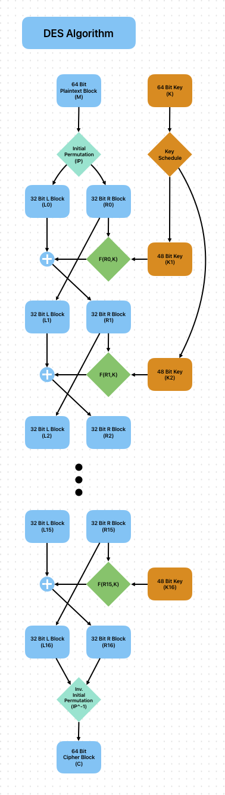
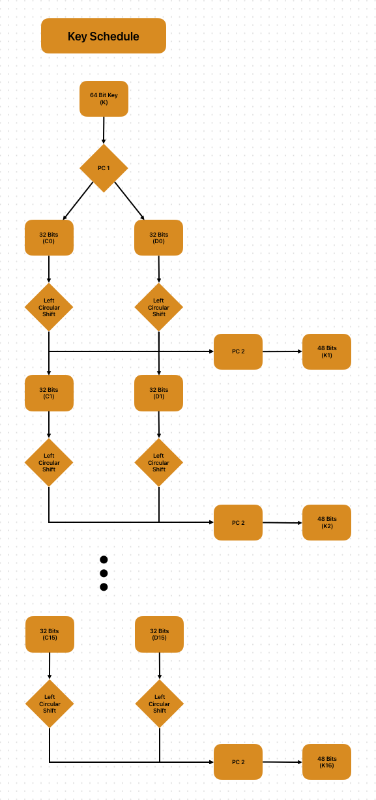
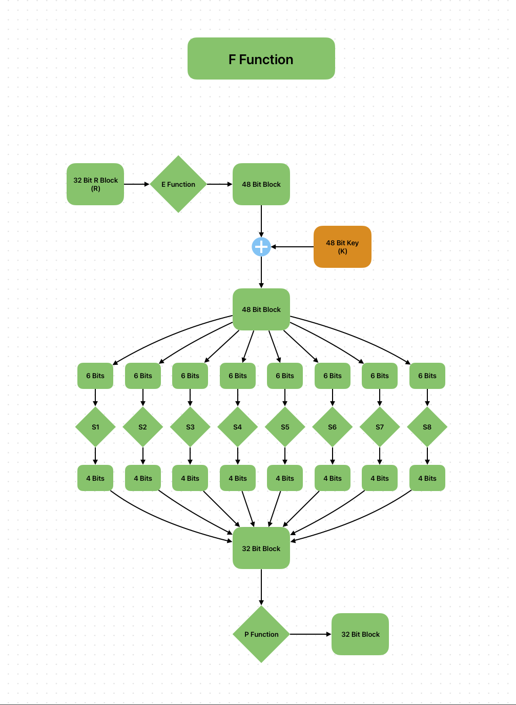

# TripleDES Implementation with SHA-256

## Introduction

## SHA-256

### Overview

SHA-256 is a SHA (Secure Hash Algorithm) that takes a plaintext message and outputs it into a 256-bit hash that cannot be decrypted inversely. The process can be generalized into preprocessing and hash computation. The plaintext is first padded so that it can then parsed into 512-bit chunks evenly. 8 hash values are then computed by applying a series of functions to the 512-bit chunks and updating the hash values accordingly. The final hash is a concatenation of all 8 hash values.

### Constants

The 8 initial hash values are as follows:

```c
static int HASH_ARR[8] = {0x6a09e667, 0xbb67ae85, 0x3c6ef372, 0xa54ff53a,
                          0x510e527f, 0x9b05688c, 0x1f83d9ab, 0x5be0cd19
};
```

```c
static int K_ARR[64] = {
    0x428a2f98, 0x71374491, 0xb5c0fbcf, 0xe9b5dba5, 0x3956c25b, 0x59f111f1,
    0x923f82a4, 0xab1c5ed5, 0xd807aa98, 0x12835b01, 0x243185be, 0x550c7dc3,
    0x72be5d74, 0x80deb1fe, 0x9bdc06a7, 0xc19bf174, 0xe49b69c1, 0xefbe4786,
    0x0fc19dc6, 0x240ca1cc, 0x2de92c6f, 0x4a7484aa, 0x5cb0a9dc, 0x76f988da,
    0x983e5152, 0xa831c66d, 0xb00327c8, 0xbf597fc7, 0xc6e00bf3, 0xd5a79147,
    0x06ca6351, 0x14292967, 0x27b70a85, 0x2e1b2138, 0x4d2c6dfc, 0x53380d13,
    0x650a7354, 0x766a0abb, 0x81c2c92e, 0x92722c85, 0xa2bfe8a1, 0xa81a664b,
    0xc24b8b70, 0xc76c51a3, 0xd192e819, 0xd6990624, 0xf40e3585, 0x106aa070,
    0x19a4c116, 0x1e376c08, 0x2748774c, 0x34b0bcb5, 0x391c0cb3, 0x4ed8aa4a,
    0x5b9cca4f, 0x682e6ff3, 0x748f82ee, 0x78a5636f, 0x84c87814, 0x8cc70208,
    0x90befffa, 0xa4506ceb, 0xbef9a3f7, 0xc67178f2
};
```

### Functions

### Preprocessing

#### Padding

The input is padded so that the length of the message is the smallest possible multiple of 512 bits. A singular bit of '1' is appended to the end of the message, followed by 448mod512 - 1 - i bits of '0', where i is the bit length of the original input. A 64-bit binary representation of i is then appended to the end of the message.

#### Parsing

The message is parsed into N 512-bit chunks, denoted as M<sup>(1)</sup>, M<sup>(2)</sup>, ... M<sup>(N)</sup>. The message chunks are then split into arrays of 16 32-bit words, denoted as M<sub>0</sub><sup>(i)</sup>, M<sub>1</sub><sup>(i)</sup>, ... M<sub>15</sub><sup>(i)</sup>.

### Hash Computation

#### Message Schedule Preparation

Each chunk is represented as the first 16 32-bit words in an array of 64 32-bit words. The next 48 words are computed as follows:
*W<sub>N</sub>* = σ<sub>1</sub>(*W<sub>N-2</sub>*) + *W<sub>N-7</sub>* + σ<sub>0</sub>(*W<sub>N-15</sub>*) + *W<sub>N-16</sub>*

#### Hash Value Permutations


## DES

### Overview

DES (Data Encryption Standard) is a symmetric key algorithm that encrypts data in 64-bit blocks. It uses a 64-bit key to encrypt and decrypt data. The algorithm is based on a Feistel network, which is a symmetric style structure used in the construction of block ciphers. The algorithm consists of an initial permutation, 16 rounds of key-dependent computation, and a final permutation. The key-dependent computation involves splitting the data block into two 32-bit blocks, L and R, and applying a function F to R using a 48-bit key. The key schedule function generates the 16 round keys from the 64-bit key. The algorithm is designed to be secure against differential and linear cryptanalysis.



### Key Schedule Generation (KS)



#### Splitting the Key

The 64-bit key is turned into a 56-bit key, where every 8th bit is removed. This 56-bit key is then split down the middle into two 28-bit halves, C and D.

#### Permutation Choice 1 (PC1)

The 56-bit key is then permuted using the PC1 table, which selects 56 bits from the original 64-bit key. The table is as follows:

```c
static char PC_1_ARR[56] = {
    57, 49, 41, 33, 25, 17, 9,  1,  58, 50, 42, 34, 26, 18,
    10, 2,  59, 51, 43, 35, 27, 19, 11, 3,  60, 52, 44, 36,

    63, 55, 47, 39, 31, 23, 15, 7,  62, 54, 46, 38, 30, 22,
    14, 6,  61, 53, 45, 37, 29, 21, 13, 5,  28, 20, 12, 4
};
```

#### Left Circular Shift

The C and D halves are then rotated left by one or two bits, depending on the round number. The rotation schedule is as follows:

```c
static char SHIFT_ARR[16] = {
    1, 1, 2, 2, 2, 2, 2, 2,
    1, 2, 2, 2, 2, 2, 2, 1
};
```

This rotation is done by shifting the bits to the left and wrapping the shifted bits around to the right.

#### Permutation Choice 2 (PC2)

The C and D halves are then combined and permuted using the PC2 table to generate the 48-bit subkeys for each round. The table is as follows:

```c
static char PC_2_ARR[48] = {
    14, 17, 11, 24, 1,  5,  3,  28, 15, 6,  21, 10,
    23, 19, 12, 4,  26, 8,  16, 7,  27, 20, 13, 2,

    41, 52, 31, 37, 47, 55, 30, 40, 51, 45, 33, 48,
    44, 49, 39, 56, 34, 53, 46, 42, 50, 36, 29, 32
};
```

### Encryption

#### Initial Permutation (IP)

Initial Permutation is a fixed permutation table that is applied to the input block before the first round of encryption. The table is as follows:

```c
static char IP_ARR[64] = {58, 50, 42, 34, 26, 18, 10, 2,
                          60, 52, 44, 36, 28, 20, 12, 4,
                          62, 54, 46, 38, 30, 22, 14, 6,
                          64, 56, 48, 40, 32, 24, 16, 8,
                          57, 49, 41, 33, 25, 17, 9,  1,
                          59, 51, 43, 35, 27, 19, 11, 3,
                          61, 53, 45, 37, 29, 21, 13, 5,
                          63, 55, 47, 39, 31, 23, 15, 7};
```

#### Round Function (F)

The round function is the core of the encryption process. It takes the right half of the block and the subkey for the round as input, and produces a 32-bit output. After each round, the right half of the block is XORed with the output of the round function and swapped with the left half of the block.



The round function consists of the following steps:

##### Expansion Permutation (E)

The expansion permutation is a fixed permutation table that expands the 32-bit input to 48 bits. The table is as follows:

```c
static char E_ARR[48] = {32, 1,  2,  3,  4,  5,  4,  5,  6,  7,  8,  9,
                         8,  9,  10, 11, 12, 13, 12, 13, 14, 15, 16, 17,
                         16, 17, 18, 19, 20, 21, 20, 21, 22, 23, 24, 25,
                         24, 25, 26, 27, 28, 29, 28, 29, 30, 31, 32, 1};
```

##### Substitution Box (S)

Substitution boxes (S-boxes) are used to perform the non-linear substitution step of the round function. There are 8 S-boxes, each taking a 6-bit input and producing a 4-bit output. The S-boxes are defined as follows:

```c
static char S_PRIM_ARR[8][64] = {
    {14, 4,  13, 1, 2,  15, 11, 8,  3,  10, 6,  12, 5,  9,  0, 7,
     0,  15, 7,  4, 14, 2,  13, 1,  10, 6,  12, 11, 9,  5,  3, 8,
     4,  1,  14, 8, 13, 6,  2,  11, 15, 12, 9,  7,  3,  10, 5, 0,
     15, 12, 8,  2, 4,  9,  1,  7,  5,  11, 3,  14, 10, 0,  6, 13},

    {15, 1,  8,  14, 6,  11, 3,  4,  9,  7, 2,  13, 12, 0, 5,  10,
     3,  13, 4,  7,  15, 2,  8,  14, 12, 0, 1,  10, 6,  9, 11, 5,
     0,  14, 7,  11, 10, 4,  13, 1,  5,  8, 12, 6,  9,  3, 2,  15,
     13, 8,  10, 1,  3,  15, 4,  2,  11, 6, 7,  12, 0,  5, 14, 9},

    {10, 0,  9,  14, 6, 3,  15, 5,  1,  13, 12, 7,  11, 4,  2,  8,
     13, 7,  0,  9,  3, 4,  6,  10, 2,  8,  5,  14, 12, 11, 15, 1,
     13, 6,  4,  9,  8, 15, 3,  0,  11, 1,  2,  12, 5,  10, 14, 7,
     1,  10, 13, 0,  6, 9,  8,  7,  4,  15, 14, 3,  11, 5,  2,  12},

    {7,  13, 14, 3, 0,  6,  9,  10, 1,  2, 8, 5,  11, 12, 4,  15,
     13, 8,  11, 5, 6,  15, 0,  3,  4,  7, 2, 12, 1,  10, 14, 9,
     10, 6,  9,  0, 12, 11, 7,  13, 15, 1, 3, 14, 5,  2,  8,  4,
     3,  15, 0,  6, 10, 1,  13, 8,  9,  4, 5, 11, 12, 7,  2,  14},

    {2,  12, 4,  1,  7,  10, 11, 6,  8,  5,  3,  15, 13, 0, 14, 9,
     14, 11, 2,  12, 4,  7,  13, 1,  5,  0,  15, 10, 3,  9, 8,  6,
     4,  2,  1,  11, 10, 13, 7,  8,  15, 9,  12, 5,  6,  3, 0,  14,
     11, 8,  12, 7,  1,  14, 2,  13, 6,  15, 0,  9,  10, 4, 5,  3},

    {12, 1,  10, 15, 9, 2,  6,  8,  0,  13, 3,  4,  14, 7,  5,  11,
     10, 15, 4,  2,  7, 12, 9,  5,  6,  1,  13, 14, 0,  11, 3,  8,
     9,  14, 15, 5,  2, 8,  12, 3,  7,  0,  4,  10, 1,  13, 11, 6,
     4,  3,  2,  12, 9, 5,  15, 10, 11, 14, 1,  7,  6,  0,  8,  13},

    {4,  11, 2,  14, 15, 0, 8,  13, 3,  12, 9, 7,  5,  10, 6, 1,
     13, 0,  11, 7,  4,  9, 1,  10, 14, 3,  5, 12, 2,  15, 8, 6,
     1,  4,  11, 13, 12, 3, 7,  14, 10, 15, 6, 8,  0,  5,  9, 2,
     6,  11, 13, 8,  1,  4, 10, 7,  9,  5,  0, 15, 14, 2,  3, 12},

    {13, 2,  8,  4, 6,  15, 11, 1,  10, 9,  3,  14, 5,  0,  12, 7,
     1,  15, 13, 8, 10, 3,  7,  4,  12, 5,  6,  11, 0,  14, 9,  2,
     7,  11, 4,  1, 9,  12, 14, 2,  0,  6,  10, 13, 15, 3,  5,  8,
     2,  1,  14, 7, 4,  10, 8,  13, 15, 12, 9,  0,  3,  5,  6,  11}};
```

##### Round Permutation (P)

The round permutation is a fixed permutation table that is applied to the output of the S-boxes before the result is XORed with the left half of the block. The table is as follows:

```c
static char P_ARR[32] = {16, 7, 20, 21, 29, 12, 28, 17,
                         1,  15, 23, 26, 5, 18, 31, 10,
                         2,  8,  24, 14, 32, 27, 3,  9,
                         19, 13, 30, 6,  22, 11, 4, 25};
```

#### Final Permutation (IPI)

The final permutation is a fixed permutation table, which is the inverse of the IP, that is applied to the output of the last round of encryption before the final ciphertext is produced. The table is as follows:

```c
static char IPI_ARR[64] = {40, 8,  48, 16, 56, 24, 64, 32,
                           45, 13, 53, 21, 61, 29, 36,  4,  
                           44, 12, 52, 20, 60, 28, 35,  3,  
                           43, 11, 51, 19, 59, 27, 34,  2,  
                           42, 10, 50, 18, 58, 26, 33,  1,  
                           41, 9,  49, 17, 57, 25};
```

### Decryption

Decryption is the same as encryption, except that the subkeys are used in reverse order. The decryption process is as follows:

1. Apply the initial permutation (IP) to the input block.
2. Perform 16 rounds of encryption using the subkeys in reverse order, from round 16 to round 1.
3. Apply the final permutation (IPI) to the output of the last round.
